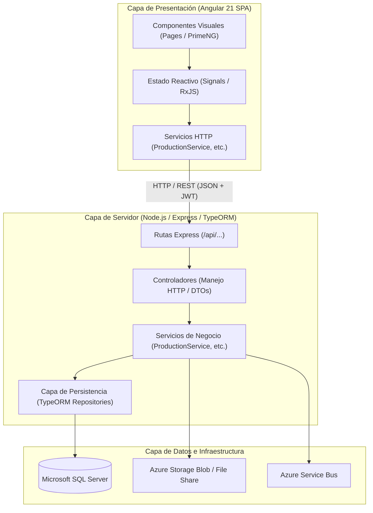
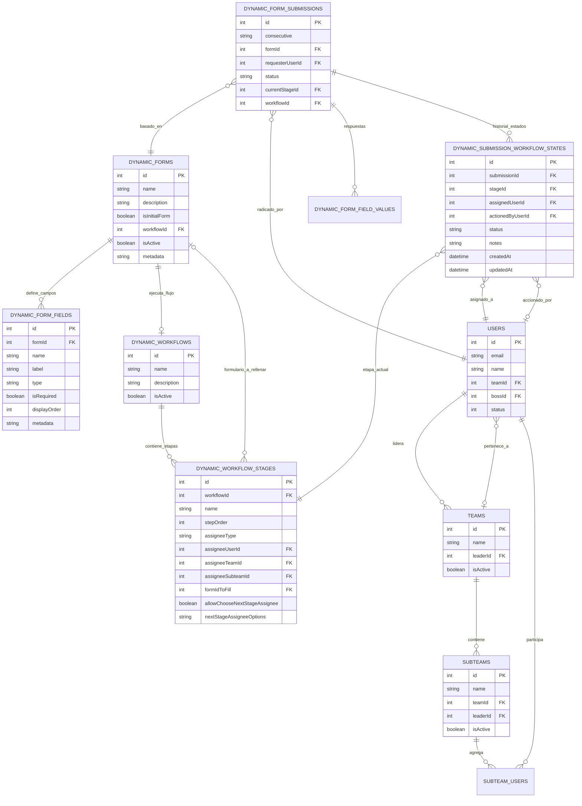
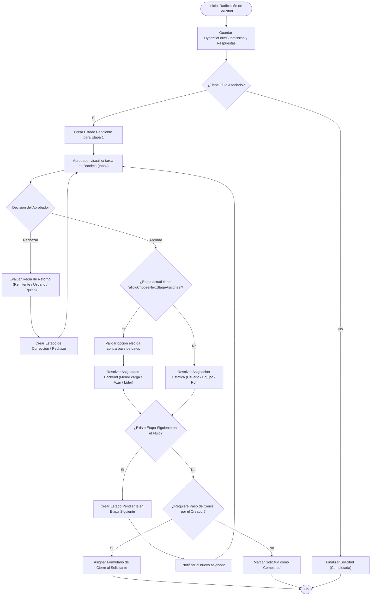
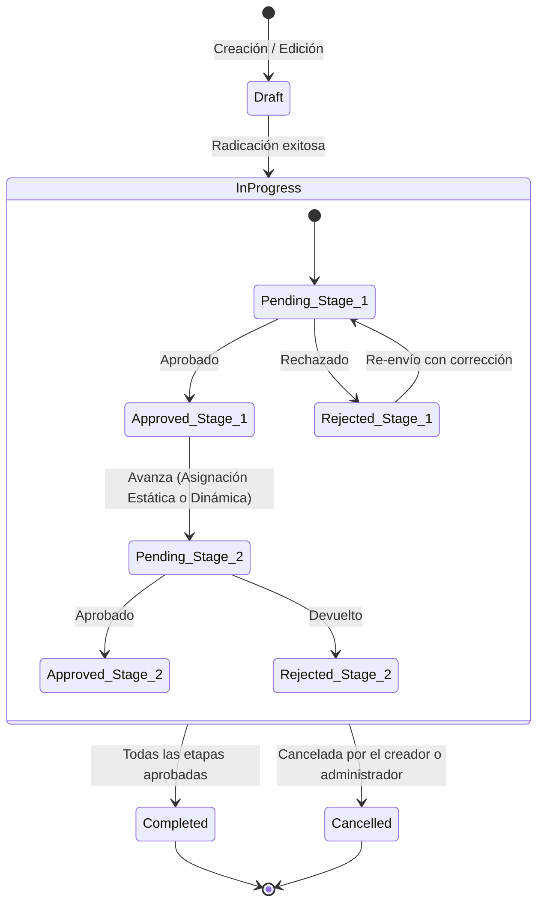

# VOC & NOC — Sistema de Conciliaciones, Producción y Flujos de Trabajo Dinámicos

[](https://nodejs.org/)
[](https://www.typescriptlang.org/)
[](https://angular.dev/)
[](https://primeng.org/)
[](https://expressjs.com/)
[](https://typeorm.io/)
[](https://www.microsoft.com/sql-server)
[](https://azure.microsoft.com/)

---

## 📑 Tabla de Contenido

1. [Descripción General del Proyecto](#1-descripción-general-del-proyecto)
2. [Estructura del Monorepo y Organización de Archivos](#2-estructura-del-monorepo-y-organización-de-archivos)
3. [Stack Tecnológico Detallado](#3-stack-tecnológico-detallado)
4. [Arquitectura del Sistema y Principios de Diseño](#4-arquitectura-del-sistema-y-principios-de-diseño)
   - [Principios SOLID](#principios-solid-aplicados)
   - [Patrones de Diseño](#patrones-de-diseño-utilizados)
   - [Segregación de Lógica: Backend vs. Frontend](#segregación-de-lógica-backend-vs-frontend)
5. [Diagramas de Base de Datos y Procesos](#5-diagramas-de-base-de-datos-y-procesos)
   - [Diagrama Entidad-Relación (ERD)](#diagrama-entidad-relación-erd)
   - [Diagrama de Flujo del Motor de Solicitudes y Flujos](#diagrama-de-flujo-del-motor-de-solicitudes-y-flujos)
   - [Diagrama de Estados del Ciclo de Vida](#diagrama-de-estados-del-ciclo-de-vida)
6. [Instalación y Configuración para Nuevos Servidores](#6-instalación-y-configuración-para-nuevos-servidores)
   - [Requisitos Previos](#requisitos-previos)
   - [Paso a Paso de Instalación](#paso-a-paso-de-instalación)
   - [Configuración de Variables de Entorno (.env)](#configuración-de-variables-de-entorno-env)
   - [Inicialización y Migraciones de Base de Datos](#inicialización-y-migraciones-de-base-de-datos)
7. [Guía de Despliegue en Producción](#7-guía-de-despliegue-en-producción)
   - [Despliegue del Backend con PM2 o Systemd](#despliegue-del-backend-con-pm2-o-systemd)
   - [Despliegue del Frontend con Nginx (Reverse Proxy & SPA)](#despliegue-del-frontend-con-nginx-reverse-proxy--spa)
   - [Despliegue en Azure (App Service & Static Web Apps)](#despliegue-en-azure-app-service--static-web-apps)
8. [Seguridad y Control de Acceso (RBAC)](#8-seguridad-y-control-de-acceso-rbac)
9. [Catálogo de Endpoints de la API REST](#9-catálogo-de-endpoints-de-la-api-rest)
10. [Comandos y Scripts NPM Disponibles](#10-comandos-y-scripts-npm-disponibles)
11. [Diagnóstico y Solución de Problemas (Troubleshooting)](#11-diagnóstico-y-solución-de-problemas-troubleshooting)

---

## 1. Descripción General del Proyecto

Este repositorio es una solución integral construida como un **Monorepo** que unifica la gestión de procesos operativos, auditoría publicitaria, conciliaciones de tráfico y automatización de flujos de trabajo en dos frentes principales:

1. **VOC (Voice of Customer — Producción y Conciliaciones):**
   - **Generador Dinámico de Formularios (Form Builder):** Permite diseñar plantillas de solicitudes sin tocar código, configurando campos de texto, números, monedas, archivos, selects y lógica de visibilidad condicional.
   - **Motor de Flujos de Trabajo Configurables (BPMN Workflow Engine):** Permite modelar etapas de aprobación secuenciales o paralelas, reglas de rechazo, subflujos, bifurcación por múltiples formularios y **asignaciones dinámicas de etapas posteriores** (elegidas en tiempo real por el aprobador anterior).
   - **Bandeja Unificada de Tareas:** Módulos de inbox para que usuarios, líderes de equipo y analistas gestionen solicitudes pendientes, adjunten evidencias, agreguen comentarios obligatorios y emitan aprobaciones o devoluciones.
   - **Gestión de Conciliaciones Publicitarias:** Control de campañas comerciales, detalle de pautas, audiencias, clientes y presupuestos.

2. **NOC (Network Operations Center — Monitoreo & Automatización):**
   - **Monitoreo de Cobertura cada 15 Minutos:** Trazabilidad continua de métricas e ingresos de portales y redes sociales.
   - **Programador Automático de Noticias (Scheduler):** Orquestación y generación automatizada de borradores de noticias integrada con **Azure Service Bus** para colas de mensajería asíncrona.
   - **Dashboard Ejecutivo:** Gráficas en tiempo real de estados de módulos, salud del sistema y volumen transaccional.

---

## 2. Estructura del Monorepo y Organización de Archivos

El proyecto utiliza **npm workspaces** con dos paquetes raíz: `backend` y `frontend`.

```
front-conciliaciones/
├── backend/                              # Servidor Node.js / Express / TypeORM
│   ├── src/
│   │   ├── config/                       # Configuración de base de datos, TypeORM y Zod (.env)
│   │   │   ├── database.ts               # Conexión nativa MSSQL ConnectionPool
│   │   │   ├── env.config.ts             # Validación estricta con Zod del entorno
│   │   │   └── typeorm.config.ts         # DataSource principal de TypeORM
│   │   ├── constants/                    # Constantes de negocio y diccionarios
│   │   ├── controllers/                  # Controladores HTTP (manejo de req, res y status)
│   │   │   ├── auth.controller.ts        # Login, refresh token, perfil de usuario
│   │   │   ├── production.controller.ts  # CRUD de formularios, flujos, etapas y aprobaciones
│   │   │   ├── user.controller.ts        # CRUD de usuarios y permisos
│   │   │   ├── team.controller.ts        # CRUD de equipos y subequipos
│   │   │   ├── menu.controller.ts        # Gestión de menú dinámico
│   │   │   └── noc.controller.ts         # Métricas de portal, redes y news scheduler
│   │   ├── middleware/                   # Middlewares Express (Auth JWT, CORS, Logs, Errores)
│   │   │   ├── actionLogger.ts           # Auditoría de acciones en BD (UserActionLog)
│   │   │   ├── auth.middleware.ts        # Validación de JWT y RBAC
│   │   │   └── errorHandler.ts           # Manejador centralizado de excepciones
│   │   ├── migrations/                   # Migraciones versionadas de base de datos
│   │   ├── models/                       # Entidades TypeORM (45 modelos fuertemente tipados)
│   │   │   ├── User.ts                   # Entidad de usuarios
│   │   │   ├── Team.ts / Subteam.ts      # Entidades de estructura organizacional
│   │   │   ├── DynamicForm*.ts           # Formularios, campos y valores de respuesta
│   │   │   ├── DynamicWorkflow*.ts       # Flujos de trabajo y etapas
│   │   │   ├── DynamicSubmission*.ts     # Radicados y estados de aprobación
│   │   │   └── index.ts                  # Exportación centralizada de entidades
│   │   ├── routes/                       # Enrutadores Express mapeados a /api/...
│   │   ├── scripts/                      # Utilidades de mantenimiento (ej: migrate.ts)
│   │   ├── services/                     # LÓGICA DE NEGOCIO Y REGLAS DE DOMINIO
│   │   │   ├── production.service.ts     # Motor BPMN, asignación de etapas y cargas
│   │   │   ├── user.service.ts           # Lógica de usuarios y seguridad
│   │   │   ├── notification.service.ts   # Notificaciones en plataforma
│   │   │   └── azure_service_bus_scheduler.service.ts # Colas Azure Service Bus
│   │   ├── types/                        # Interfaces y contratos TypeScript compartidos
│   │   ├── utils/                        # Funciones utilitarias y asistentes
│   │   ├── app.ts                        # Configuración de Express, CORS, Helmet y Rutas
│   │   └── server.ts                     # Entrada: Bootstrap, inicialización de BD y Socket
│   ├── ormconfig.ts                      # Configuración de TypeORM CLI
│   ├── package.json                      # Dependencias y scripts del backend
│   └── tsconfig.json                     # Configuración de TypeScript
│
├── frontend/                             # Aplicación Single Page Application (SPA)
│   ├── voc/                              # Proyecto Angular 21 (incluye módulos VOC y NOC)
│   │   ├── src/
│   │   │   ├── app/
│   │   │   │   ├── components/           # Componentes UI reutilizables (navbar, modales, etc.)
│   │   │   │   ├── constants/            # Opciones estáticas de formularios e íconos
│   │   │   │   ├── guards/               # Route guards (AuthGuard, PermissionGuard)
│   │   │   │   ├── interceptors/         # HttpInterceptor para adjuntar JWT y capturar 401
│   │   │   │   ├── models/               # Interfaces frontend para tipado de respuestas
│   │   │   │   ├── pages/                # Vistas principales (Standalone Components)
│   │   │   │   │   ├── requests-beta-admin/  # Configurador de plantillas y flujos BPMN
│   │   │   │   │   ├── requests-beta-inbox/  # Bandeja de solicitudes y aprobaciones
│   │   │   │   │   ├── production-beta/      # Gestión de solicitudes de producción
│   │   │   │   │   ├── menus/                # Administrador de menús y permisos
│   │   │   │   │   ├── dashboard/            # Tableros ejecutivos y gráficos
│   │   │   │   │   └── auth/                 # Pantalla de Login y recuperación
│   │   │   │   ├── pipes/                # Pipes para formateo de moneda, fechas, filtros
│   │   │   │   ├── services/             # Servicios HTTP (consumen la API REST del backend)
│   │   │   │   ├── app.config.ts         # Proveedores de Angular (Router, PrimeNG, Animations)
│   │   │   │   └── app.routes.ts         # Tabla de rutas protegidas
│   │   │   ├── environments/             # Variables de entorno por ambiente
│   │   │   │   ├── environment.ts        # Entorno local / desarrollo
│   │   │   │   └── environment.prod.ts   # Entorno de producción (URL API Azure / Servidor)
│   │   │   └── styles.scss               # Estilos globales y temas de PrimeNG
│   │   ├── proxy.conf.json               # Configuración de Reverse Proxy para desarrollo
│   │   ├── package.json                  # Dependencias de Angular, PrimeNG y Tailwind
│   │   └── tsconfig.json
│
├── .agents/rules/                        # Reglas automáticas de despliegue
│   ├── deployment-voc.md                 # Guía de despliegue para VOC
│   └── deployment-noc.md                 # Guía de despliegue para NOC
├── deploy-to-azure.ps1                   # Script PowerShell para despliegue en Azure App Service
├── package.json                          # Package.json raíz del Monorepo con workspaces
└── README.md                             # Documentación maestra del repositorio
```

---

## 3. Stack Tecnológico Detallado

### Backend (API REST & Background Processing)
| Tecnología | Versión | Propósito en el Sistema |
| :--- | :--- | :--- |
| **Node.js** | `>= 20.x` | Entorno de ejecución en servidor de alto rendimiento no bloqueante |
| **TypeScript** | `5.9.x` | Tipado estático estricto para modelos, controladores y lógica de negocio |
| **Express.js** | `4.21.2` | Framework HTTP modular y robusto para exposición de la API REST |
| **TypeORM** | `0.3.27` | ORM para mapeo objeto-relacional, migraciones y transacciones SQL |
| **Microsoft SQL Server (`mssql`)**| `11.0.1` | Motor de base de datos relacional empresarial y pool de conexiones |
| **Azure Storage Blob & File Share** | `12.27+` | Almacenamiento seguro de archivos adjuntos, PDFs y certificados |
| **Azure Service Bus** | `7.9.5` | Bus de eventos asíncrono para programadores de noticias y tareas |
| **Zod** | `4.1.x` | Validación estricta y schema parsing de variables de entorno al iniciar |
| **JWT (`jsonwebtoken`) & Bcrypt** | `9.0 / 6.0` | Generación y verificación de tokens seguros y hashing de contraseñas |
| **Helmet & Rate Limit** | `8.1 / 8.0` | Seguridad de cabeceras HTTP y protección contra ataques de fuerza bruta |

### Frontend (User Interface & Experiencia de Usuario)
| Tecnología | Versión | Propósito en el Sistema |
| :--- | :--- | :--- |
| **Angular** | `21.0.x` | Framework SPA moderno con **Signals reactivos** y Standalone Components |
| **PrimeNG** | `21.0.1` | Suite de componentes UI empresariales (Tablas, Diálogos, Selectores, Árboles) |
| **PrimeFlex & TailwindCSS** | `4.0 / 3.4` | Utilidades de maquetación responsiva y diseño visual moderno |
| **Lucide Icons** | `1.23.0` | Conjunto uniforme y estilizado de iconografía vectorial en toda la UI |
| **Chart.js & ng2-charts** | `4.5 / 10.0` | Visualización de datos estadísticos y métricas de conciliación en tiempo real |
| **ExcelJS & FileSaver** | `4.4 / 2.0` | Exportación e importación masiva de reportes a hojas de cálculo Excel |
| **RxJS** | `7.8.x` | Programación reactiva para comunicación asíncrona HTTP y estado global |

---

## 4. Arquitectura del Sistema y Principios de Diseño

El sistema está construido siguiendo la **Arquitectura en N-Capas (Layered Architecture)**, separando estrictamente la presentación, la orquestación HTTP, la lógica de negocio y la persistencia de datos:



### Principios SOLID Aplicados

* **S — Single Responsibility Principle (Responsabilidad Única):**
  - **Frontend:** Se limita exclusivamente a pintar la interfaz, recopilar la entrada del usuario y mostrar notificaciones. **No toma decisiones de negocio.**
  - **Controlador:** Únicamente desempaqueta el request, valida la autenticación y delega la ejecución al servicio.
  - **Servicio:** Concentra el 100% de las reglas del negocio: validación de opciones permitidas, sorteos de asignación, cálculos de carga y transacciones en BD.
* **O — Open/Closed Principle (Abierto / Cerrado):**
  - El motor de asignaciones (`resolveChosenAssignee`) y el evaluador de estados de flujo están abiertos a incorporar nuevas estrategias de asignación (ej: balanceo de carga, round-robin) sin necesidad de modificar los controladores ni alterar el esquema de transiciones de estados.
* **L — Liskov Substitution Principle (Sustitución de Liskov):**
  - Toda etapa de flujo (`DynamicWorkflowStage`) y estado de solicitud (`DynamicSubmissionWorkflowState`) cumple el mismo contrato uniforme. El motor de ejecución procesa de manera polimórfica una etapa sin importar si su asignación fue estática, dinámica o por subflujo.
* **I — Interface Segregation Principle (Segregación de Interfaces):**
  - Contratos de datos claramente separados (`WorkflowStageItem`, `NextStageAssigneeOptionConfig`, `MultiFormOptionConfig`), evitando objetos sobrecargados con campos innecesarios.
* **D — Dependency Inversion Principle (Inversión de Dependencias):**
  - En el frontend, los componentes dependen de abstracciones y servicios inyectables singleton (`@Injectable({ providedIn: 'root' })`). En el backend, las transacciones se orquestan a través de `EntityManager` desacoplado del driver concreto.

### Patrones de Diseño Utilizados

1. **Patrón Estrategia (Strategy Pattern):**
   - Empleado en `resolveChosenAssignee` para calcular el usuario asignado en tiempo real según la política configurada:
     - `team_random`: Selección aleatoria entre miembros activos de un equipo.
     - `team_workload`: Selección por menor número de tareas pendientes en base de datos.
     - `team_leader`: Resolución del líder del equipo.
     - `subteam_random`: Sorteo entre miembros activos de un subequipo específico.
     - `requester` / `requester_boss`: Resolución del solicitante original o su jefe directo en la jerarquía.
2. **Patrón Estado (State Pattern):**
   - El ciclo de vida de una solicitud transiciona rigurosamente entre estados: `Draft` ➔ `Pending` ➔ `In Progress` ➔ `Approved` / `Rejected` ➔ `Completed`, gobernando qué acciones están permitidas en cada fase.
3. **Patrón Observador (Observer Pattern):**
   - En el frontend, mediante **Angular Signals** y **RxJS**, los componentes reaccionan instantáneamente a cambios en la configuración (ej: cuando se activa la elección dinámica en la etapa $i$, la etapa $i+1$ se bloquea de inmediato de forma reactiva). En el backend, mediante los listeners asíncronos de Azure Service Bus.
4. **Patrón DTO (Data Transfer Object) & Mapper:**
   - La información de auditoría, las opciones enriquecidas con etiquetas legibles (`displayLabel`) y los payloads de creación se limpian y transforman antes de viajar entre capas.

### Segregación de Lógica: Backend vs. Frontend

| Responsabilidad | Capa Responsable | Detalle |
| :--- | :---: | :--- |
| **Sorteo al azar de usuarios de equipo/subequipo** | **Backend** | El backend consulta a los usuarios activos en la BD y efectúa la selección aleatoria en el servidor. |
| **Cálculo de usuario con menor carga** | **Backend** | El backend ejecuta la agregación en SQL para contar tareas pendientes reales. El frontend desconoce estos datos. |
| **Validación de integridad anti-manipulación** | **Backend** | Si una petición maliciosa envía un `userId` no autorizado para esa etapa, el backend valida contra la configuración de la BD y **aborta la transacción con error 400**. |
| **Creación de estados y envío de notificaciones** | **Backend** | El backend registra atómicamente el estado en `DynamicSubmissionWorkflowStates` y despacha alertas. |
| **Visualización y Captura de Datos** | **Frontend** | Renderizado de controles PrimeNG, banners informativos con candado (`pi pi-lock`) y selección del usuario. |

---

## 5. Diagramas de Base de Datos y Procesos

### Diagrama Entidad-Relación (ERD)



### Diagrama de Flujo del Motor de Solicitudes y Flujos



### Diagrama de Estados del Ciclo de Vida



---

## 6. Instalación y Configuración para Nuevos Servidores

### Requisitos Previos
* **Node.js:** Versión `20.18.x` o superior (LTS recomendada).
* **Gestor de Paquetes:** `npm` versión `10.x` o superior.
* **Base de Datos:** Microsoft SQL Server 2019 o superior (o Azure SQL Database).
* **Git:** Para clonación del repositorio.

### Paso a Paso de Instalación

1. **Clonar el repositorio:**
   ```bash
   git clone <URL_DEL_REPOSITORIO>
   cd front-conciliaciones
   ```

2. **Instalar dependencias del Monorepo:**
   ```bash
   npm run install:all
   ```
   *Esto instalará automáticamente todas las dependencias compartidas de la raíz, así como las del `backend` y el `frontend`.*

### Configuración de Variables de Entorno (.env)

Crea el archivo `backend/.env` copiando la siguiente plantilla y completando las credenciales de tu servidor:

```env
# ==============================================================================
# CONFIGURACIÓN GENERAL DEL SERVIDOR
# ==============================================================================
PORT=22741
NODE_ENV=production
FRONTEND_URL=https://tu-dominio-frontend.com

# ==============================================================================
# BASE DE DATOS (MICROSOFT SQL SERVER)
# ==============================================================================
DB_SERVER=127.0.0.1
DB_PORT=1433
DB_USER=sa
DB_PASSWORD=TuPasswordSeguro123*
DB_DATABASE=voc_db
DB_ENCRYPT=false
DB_TRUST_SERVER_CERTIFICATE=true

# ==============================================================================
# AUTENTICACIÓN Y SEGURIDAD JWT
# ==============================================================================
JWT_SECRET=clave_super_secreta_de_al_menos_32_caracteres_aleatorios_12345
JWT_EXPIRES_IN=24h
JWT_REFRESH_EXPIRES_IN=7d

# ==============================================================================
# RATE LIMITING Y LOGS
# ==============================================================================
RATE_LIMIT_WINDOW_MS=900000
RATE_LIMIT_MAX_REQUESTS=1000
LOG_LEVEL=info

# ==============================================================================
# AZURE STORAGE (OPCIONAL - PARA SUBIDA DE ARCHIVOS ADJUNTOS)
# ==============================================================================
AZURE_STORAGE_ACCOUNT_NAME=
AZURE_STORAGE_ACCOUNT_KEY=
AZURE_STORAGE_CONTAINER_NAME=voc-uploads

# ==============================================================================
# AZURE SERVICE BUS (OPCIONAL - PARA SCHEDULER ASÍNCRONO DEL NOC)
# ==============================================================================
AZURE_SERVICE_BUS_CONNECTION_STRING=
AZURE_SERVICE_BUS_QUEUE_NAME=noc-news-schedules
```

En el frontend, configura la URL base de la API en `frontend/voc/src/environments/environment.prod.ts`:

```typescript
export const environment = {
  production: true,
  apiUrl: 'https://tu-dominio-backend.com/api',
  // Configuraciones de servicios auxiliares...
};
```

### Inicialización y Migraciones de Base de Datos

El backend incluye scripts automatizados para ejecutar y auditar las migraciones de TypeORM:

```bash
# 1. Posicionarse en la carpeta backend
cd backend

# 2. Ejecutar las migraciones pendientes en SQL Server
npm run db:init
# (Equivalente a: npm run migrate run)

# 3. Verificar el estado de las migraciones
npm run db:status

# 4. En caso de requerir revertir la última migración
npm run db:rollback
```

---

## 7. Guía de Despliegue en Producción

### Despliegue del Backend con PM2 o Systemd

1. **Compilar el código TypeScript del backend:**
   ```bash
   cd backend
   npm run build
   ```
   *Esto generará el código JavaScript listo para producción en `backend/dist/`.*

2. **Ejecutar el servidor con PM2 (Process Manager):**
   ```bash
   npm install -g pm2
   pm2 start dist/server.js --name "voc-backend" --node-args="-r dotenv/config"
   pm2 save
   pm2 startup
   ```

3. **Verificar estado y monitoreo:**
   ```bash
   pm2 status
   pm2 logs voc-backend
   ```
   *Puedes comprobar la salud del sistema accediendo a: `http://localhost:22741/api/health`.*

### Despliegue del Frontend con Nginx (Reverse Proxy & SPA)

1. **Compilar los bundles de Angular para producción:**
   ```bash
   cd frontend
   npm run build:voc
   ```
   *Los archivos optimizados y minificados se emitirán en `frontend/dist/voc/browser/`.*

2. **Configuración recomendada de Nginx (`/etc/nginx/sites-available/voc.conf`):**

   ```nginx
   server {
       listen 80;
       server_name voc.tudominio.com;
       return 301 https://$host$request_uri;
   }

   server {
       listen 443 ssl http2;
       server_name voc.tudominio.com;

       ssl_certificate /etc/letsencrypt/live/voc.tudominio.com/fullchain.pem;
       ssl_certificate_key /etc/letsencrypt/live/voc.tudominio.com/privkey.pem;

       root /var/www/front-conciliaciones/frontend/dist/voc/browser;
       index index.html;

       # Manejo de rutas SPA de Angular (evita errores 404 al recargar)
       location / {
           try_files $uri $uri/ /index.html;
       }

       # Reverse Proxy hacia la API REST del backend
       location /api/ {
           proxy_pass http://127.0.0.1:22741/api/;
           proxy_http_version 1.1;
           proxy_set_header Upgrade $http_upgrade;
           proxy_set_header Connection 'upgrade';
           proxy_set_header Host $host;
           proxy_cache_bypass $http_upgrade;
           proxy_set_header X-Real-IP $remote_addr;
           proxy_set_header X-Forwarded-For $proxy_add_x_forwarded_for;
           proxy_set_header X-Forwarded-Proto $scheme;
           client_max_body_size 50M;
       }

       # Endpoint directo de Healthcheck
       location /health {
           proxy_pass http://127.0.0.1:22741/health;
       }
   }
   ```

3. **Recargar Nginx:**
   ```bash
   sudo nginx -t && sudo systemctl reload nginx
   ```

### Despliegue en Azure (App Service & Static Web Apps)

El repositorio incluye automatizaciones preconfiguradas:
* **Backend a Azure App Service:** Utiliza el script PowerShell `./deploy-to-azure.ps1 -ResourceGroup "<Grupo>" -AppName "<NombreApp>" -SubscriptionId "<Id>"`.
* **Frontend a Azure Static Web Apps:** Despliegue continuo por GitHub Actions a través de los flujos de trabajo en `.github/workflows/`.

---

## 8. Seguridad y Control de Acceso (RBAC)

1. **Autenticación Basada en Tokens JWT:**
   - Tokens firmados con algoritmo HS256 y expiración configurable (`JWT_EXPIRES_IN`).
   - El token viaja en las cabeceras `Authorization: Bearer <token>` y es verificado en cada endpoint por el middleware `auth.middleware.ts`.
2. **Control Granular de Permisos:**
   - Tabla `Permissions` y relación `PermissionByUser`.
   - Menús dinámicos controlados por permisos en base de datos.
   - Si un usuario no posee el permiso explícito en la base de datos o en su rol, ni el menú ni la ruta del frontend son accesibles (`guards/permission.guard.ts`).
3. **Auditoría Centralizada (`UserActionLog`):**
   - El middleware `actionLogger` captura automáticamente el método, ruta, IP, identificador de usuario, parámetros y cuerpo de cada petición que modifica el estado del sistema.
4. **Protección Anti-Inyección SQL:**
   - TypeORM realiza consultas parametrizadas obligatorias. No existe concatenación directa de cadenas SQL en la capa de servicios.

---

## 9. Catálogo de Endpoints de la API REST

### Autenticación y Usuarios
| Método | Endpoint | Descripción |
| :---: | :--- | :--- |
| `POST` | `/api/auth/login` | Iniciar sesión y obtener token JWT |
| `GET` | `/api/auth/profile` | Obtener datos del usuario autenticado |
| `POST` | `/api/auth/refresh` | Renovar token JWT expirado |
| `GET` | `/api/users` | Listar todos los usuarios activos |
| `POST` | `/api/users` | Crear un nuevo usuario |
| `PUT` | `/api/users/:id` | Modificar datos y rol de un usuario |

### Formularios y Flujos BPMN (Producción)
| Método | Endpoint | Descripción |
| :---: | :--- | :--- |
| `GET` | `/api/production/forms` | Listar formularios dinámicos |
| `POST` | `/api/production/forms` | Crear una nueva plantilla de formulario |
| `GET` | `/api/production/forms/:id/fields` | Obtener campos dinámicos de un formulario |
| `POST` | `/api/production/forms/:id/fields` | Guardar configuración de campos y dependencias |
| `GET` | `/api/production/workflows` | Listar flujos de trabajo configurados |
| `GET` | `/api/production/workflows/:id/stages` | Obtener etapas y reglas de asignación |
| `POST` | `/api/production/workflows/:id/stages` | Guardar etapas, opciones y asignaciones |
| `GET` | `/api/production/pending-approvals` | Obtener solicitudes pendientes asignadas al usuario |
| `POST` | `/api/production/action-approval` | Aprobar o rechazar etapa (con `chosenNextAssignee`) |

### Monitoreo y NOC
| Método | Endpoint | Descripción |
| :---: | :--- | :--- |
| `GET` | `/api/health` | Estado de salud, memoria, DB y Service Bus |
| `GET` | `/api/dashboard/status` | Métricas y estado de los módulos operativos |
| `GET` | `/api/noc/news-schedules` | Programaciones automáticas de noticias |
| `POST` | `/api/noc/news-schedules` | Crear / Disparar generación de noticias |

---

## 10. Comandos y Scripts NPM Disponibles

Desde la raíz del repositorio puedes ejecutar:

```bash
# Desarrollo
npm run dev               # Inicia Frontend y Backend simultáneamente en desarrollo
npm run dev:backend       # Inicia únicamente el servidor Express con Nodemon
npm run dev:frontend      # Inicia el Frontend Angular en http://localhost:5173

# Compilación
npm run build             # Compila Backend y Frontend para producción
npm run build:backend     # Compila TypeScript en backend/dist
npm run build:voc         # Compila Angular en frontend/dist/voc/browser

# Base de Datos (en backend/)
npm run db:init           # Ejecuta las migraciones pendientes en la BD
npm run db:status         # Muestra el estado actual de las migraciones
npm run db:rollback       # Revierte la última migración aplicada

# Mantenimiento
npm run clean             # Elimina carpetas node_modules y dist de todos los paquetes
npm run lint              # Ejecuta el linter en el proyecto frontend
```

---

## 11. Diagnóstico y Solución de Problemas (Troubleshooting)

### 1. Error `ECONNCLOSED` o fallo de conexión a SQL Server
* **Causa:** El servidor SQL Server rechazó la conexión o el firewall del servidor no tiene habilitado el puerto `1433`.
* **Solución:**
  1. Verifica que el servicio de SQL Server esté corriendo (`systemctl status mssql-server` o en Servicios de Windows).
  2. En el archivo `backend/.env`, si utilizas una instancia local de desarrollo, asegúrate de configurar `DB_TRUST_SERVER_CERTIFICATE=true` y `DB_ENCRYPT=false`.

### 2. Error 404 al recargar páginas en Angular (Frontend en Producción)
* **Causa:** Al ser una Single Page Application (SPA), el servidor web intenta buscar un archivo físico con la ruta solicitada en lugar de delegar el enrutamiento a `index.html`.
* **Solución:** En la configuración de Nginx, añade obligatoriamente la directiva `try_files $uri $uri/ /index.html;`.

### 3. Problemas de CORS en peticiones HTTP
* **Causa:** El origen desde el cual se carga el frontend no está explícitamente en la lista blanca del backend.
* **Solución:** Configura la variable `FRONTEND_URL=https://tu-dominio-frontend.com` en `backend/.env` o agrega el dominio al array `allowedOrigins` en `backend/src/app.ts`.

### 4. Error de compilación en Frontend por memoria insuficiente en servidores pequeños
* **Causa:** Angular CLI requiere suficiente memoria RAM para optimizar bundles durante `ng build`.
* **Solución:** Ejecuta el comando aumentando el límite de memoria de Node:
  ```bash
  NODE_OPTIONS="--max-old-space-size=4096" npm run build:voc
  ```

---

*Desarrollado y mantenido para el ecosistema **VOC & NOC** de Azemblia.*