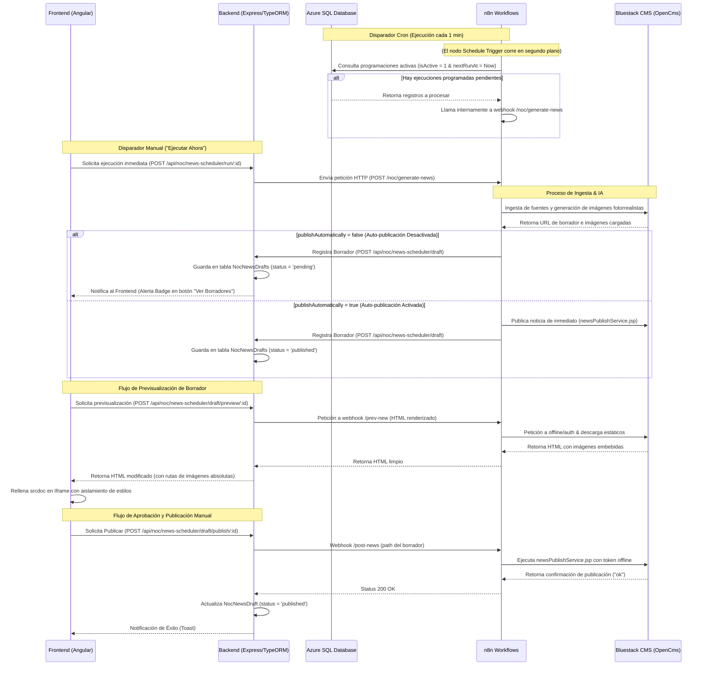

# Módulo de Auto Generación de Noticias - Documentación Técnica

Este documento describe la arquitectura, flujo de datos, modelo de base de datos e integraciones de software del módulo de **Auto Generación y Programación de Noticias** del portal NOC.

---

## 🏗️ 1. Arquitectura de Integración General

El módulo sigue una arquitectura desacoplada conectando el frontend de NOC, el backend de NOC, un motor de flujos en n8n, y el CMS de Bluestack (OpenCms):

---

## 🗄️ 2. Modelo de Base de Datos (Relaciones)

El módulo se compone de dos tablas principales gestionadas a través de **TypeORM**:

### A. Tabla: `NocNewsScheduler` (Programador)
Representa los temas y fuentes programadas por los usuarios.
* `id` (UUID, Primary Key)
* `name` (VARCHAR): Nombre representativo o tema para la IA.
* `sources` (TEXT / JSON): Lista de URLs permitidas para scraping.
* `frequency` (VARCHAR): Expresión cron o cadena de programación de ejecución.
* `isActive` (BOOLEAN): Estado del agendamiento.
* `publishAutomatically` (BOOLEAN): Flag para saltearse la bandeja de aprobación y publicar directamente.
* `createdAt` / `updatedAt` (TIMESTAMP)

### B. Tabla: `NocNewsDraft` (Borradores de Noticias)
Almacena las noticias ingestadas que están pendientes de revisión.
* `id` (UUID, Primary Key)
* `scheduleId` (UUID, Foreign Key) $\rightarrow$ Relación muchos-a-uno con `NocNewsScheduler`.
* `title` (VARCHAR): Título autogenerado de la noticia.
* `path` (VARCHAR): Ruta interna única generada por el CMS (ej. `/contenidos/2026/07/14/noticia_0001.html`).
* `status` (VARCHAR): Estado del borrador (`'pending'` | `'published'`).
* `publishedAt` (TIMESTAMP, Nullable): Fecha de publicación final.
* `createdAt` / `updatedAt` (TIMESTAMP)
---

## 🛣️ 3. Servicios y Endpoints Internos (Backend NOC)

Los controladores del backend residen en `backend/src/controllers/noc_news_scheduler.controller.ts` y se registran en `backend/src/routes/noc.routes.ts`:

| Método | Endpoint | Descripción | Cuerpo de Petición (Request Body) |
|---|---|---|---|
| **POST** | `/api/noc/news-scheduler/draft` | Registra un borrador. Llamado exclusivamente por n8n al finalizar la curaduría. | `{ "scheduleId": "UUID", "title": "String", "path": "String" }` |
| **GET** | `/api/noc/news-scheduler/draft/schedule/:scheduleId` | Devuelve la lista de borradores pendientes (`'pending'`) para un agendamiento. | N/A |
| **POST** | `/api/noc/news-scheduler/draft/preview` | Proxy de previsualización que consulta a n8n y retorna el HTML adaptado. | `{ "path": "String" }` |
| **POST** | `/api/noc/news-scheduler/draft/publish/:id` | Dispara el webhook de n8n para publicar, y si es exitoso cambia el estado a `'published'`. | N/A |

---

## 🎨 4. Frontend (Angular - Componentes Clave)

El módulo se despliega bajo `/frontend/noc/src/app/pages/noticias/`:

* **`NewsSchedulerService`** (`/app/services/news-scheduler.service.ts`):
  Conector HTTP con los endpoints del backend para gestionar agendamientos y realizar acciones sobre borradores.
* **`AutoGenerarComponent`** (`/auto-generar/`):
  * **Renderizado con Aislamiento (Iframe con `srcdoc`)**: Para prevenir que los estilos globales de TailwindCSS y PrimeFlex alteren la visualización tipográfica de la noticia (encabezados, espaciado de párrafos, listas), el HTML puro devuelto por el servicio se inyecta en un `<iframe>` mediante `[srcdoc]`.
  * **Resolución de Rutas Estáticas**: El método `previewDraft` del backend intercepta el HTML y transforma las rutas relativas de las imágenes (ej: `/img/...`) prependiéndoles el dominio absoluto para que se rendericen correctamente en el navegador del administrador de NOC.

---

## 🔌 5. Integración con Servicios Externos

### A. Webhooks en n8n
El backend de NOC se comunica con n8n mediante tres disparadores:
1. **Generación Periódica**: n8n ejecuta el scraping en las fuentes parametrizadas en el Scheduler, llama al CMS y finalmente notifica al Backend de NOC guardando el borrador.
2. **Previsualización (`/webhook/noc/prev-new`)**:
   * **Entrada**: `{ "data": { "path": "..." }, "async": false }`
   * **Salida**: Retorna el HTML del cuerpo de la noticia.
3. **Publicación (`/webhook/noc/post-news`)**:
   * **Entrada**: `{ "data": { "path": "..." }, "async": false }`
   * **Salida**: Estado de ejecución en el CMS.

### B. APIs de Bluestack CMS (OpenCms)
El workflow de n8n interactúa con Bluestack mediante las siguientes APIs:
* **`/offline/auth`**: Autenticación para previsualización offline. Retorna un `token` de sesión válido por 300 segundos.
* **`imagesAddService.jsp`**: Carga las imágenes realistas generadas por IA y devuelve su ruta relativa en el VFS (ej. `img/yyyy/MM/dd/imagen.jpeg`).
* **`newsAddService.jsp`**: Crea el borrador de la noticia inyectando metadatos y cuerpo HTML (`cuerpo`).
* **`newsPublishService.jsp`**: Toma el path del borrador y lo publica haciéndolo visible en internet. Requiere autorización del token de `/offline/auth` y el encabezado `x-security-token`.
* **Consumo de Estáticos Offline**: Para obtener imágenes de borradores aún no publicados, la petición HTTP al servidor de estáticos del CMS requiere pasar las cabeceras `USER_TOKEN`, `BROWSER_ID`, `PROJECT: "Offline"` y `SITE`.

---

## 🔌 6. Estructura y Flujo de Trabajo en n8n (Workflow "NOC")

El motor de integraciones en n8n está centralizado bajo el workflow denominado **"NOC"** (ID: `WBwgPyBQ6RcIu1LG`). Este flujo expone 6 puntos de entrada tipo Webhook que permiten al frontend de NOC realizar acciones asíncronas y síncronas.

### A. Catálogo de Webhooks de n8n en el flujo NOC

#### 1. Webhook: Ingesta y Generación de Noticias
* **Ruta**: `POST /noc/generate-news` (Nodo: `WebhookProd1`)
* **Propósito**: Ejecuta el pipeline completo de curaduría de la IA.
* **Flujo Interno**:
  `WebhookProd1` $\rightarrow$ `ajvJsonStructure1` (Valida formato) $\rightarrow$ `WorkFLowData3` $\rightarrow$ `cms-loginService1` (Login en CMS) $\rightarrow$ `AI Agent1` (Agente de LangChain / Gemini 3.5 Flash / Claude 3.5 Sonnet).
* **Acción Asociada**: Durante su ejecución, el `AI Agent1` invoca la herramienta dinámica `generateImage` (que realiza un sub-request a `/noc/generate-image`) para conseguir las ilustraciones de la noticia. Al finalizar la redacción, guarda el borrador en el CMS a través de `newsAddService.jsp` y notifica al Backend de NOC para que se registre en la base de datos local.

#### 2. Webhook: Generación de Imagen
* **Ruta**: `POST /noc/generate-image` (Nodo: `WebhookProd2`)
* **Propósito**: Genera una ilustración fotorrealista basada en un prompt de texto y la sube al CMS.
* **Flujo Interno**:
  `WebhookProd2` $\rightarrow$ `cms-loginService` $\rightarrow$ `ReplicateIaImageModel Body` (Elige aleatoriamente entre modelos de Replicate como `google/nano-banana`, `google/nano-banana-pro`, o `openai/gpt-image-2`) $\rightarrow$ `GenerateImageReplicate` (Llamado a la API de Replicate) $\rightarrow$ Bucle de validación de estatus (`ValidateStatus2` $\rightarrow$ `ImageStatusWay3` $\rightarrow$ `Wait3`) $\rightarrow$ `DownloadImage` (Descarga el binario) $\rightarrow$ `cmd-imageAddService` (Sube la imagen al CMS con `imagesAddService.jsp`).

#### 3. Webhook: Previsualización de Borrador
* **Ruta**: `POST /noc/prev-new` (Nodo: `WebhookProd`)
* **Propósito**: Recupera el cuerpo HTML renderizado del borrador desde el CMS en modo offline.
* **Flujo Interno**:
  `WebhookProd` $\rightarrow$ `getVariables2` $\rightarrow$ `offlineAuth` (Autentica en `/offline/auth` para obtener el token temporal) $\rightarrow$ `HTTP Request3` (Consulta el HTML a Bluestack usando el token) $\rightarrow$ Retorna el HTML crudo al Backend.

#### 4. Webhook: Publicación de Noticia
* **Ruta**: `POST /noc/post-news` (Nodo: `WebhookProd3`)
* **Propósito**: Publica formalmente el borrador convirtiéndolo en noticia visible.
* **Flujo Interno**:
  `WebhookProd3` $\rightarrow$ `cms-loginService2` $\rightarrow$ `HTTP Request` (Invoca al endpoint del CMS `newsPublishService.jsp` pasando la ruta del borrador, el token y el encabezado `x-security-token`).

#### 5. Webhook: Descarga de Imagen Offline
* **Ruta**: `POST /noc/get-image` (Nodo: `WebhookProd4`)
* **Propósito**: Permite previsualizar imágenes offline asociadas a borradores que no han sido publicados.
* **Flujo Interno**:
  `WebhookProd4` $\rightarrow$ `offlineAuth1` (Genera credenciales temporales en `/offline/auth`) $\rightarrow$ `HTTP Request4` (Descarga la imagen inyectando las cabeceras `USER_TOKEN`, `BROWSER_ID`, `PROJECT` y `SITE`).

#### 6. Webhook: Obtención de Variables
* **Ruta**: `GET /noc/get-variables` (Nodo: `Webhook`)
* **Propósito**: Devuelve la configuración de variables de entorno activas del flujo.

---

### B. Relación y Dependencias entre los Flujos

* **El Agente IA depende de la Generación de Imágenes**: El webhook principal `/noc/generate-news` no puede finalizar su JSON sin antes llamar internamente al webhook `/noc/generate-image` para cada ilustración requerida.
* **La Previsualización depende de la Autenticación Offline**: Tanto `/noc/prev-new` como `/noc/get-image` dependen del paso previo de consultar el endpoint del CMS `/offline/auth` para obtener un identificador de sesión activa (`USER_TOKEN`), el cual expira a los 300 segundos.
* **La Publicación Cierra el Ciclo**: `/noc/post-news` toma la ruta provista en la base de datos por `/noc/generate-news` y le ordena al CMS compilar y subir el archivo al servidor público de producción.

---

### C. Flujos de Disparo y Comportamiento del Scheduler

El sistema de ingesta y generación de noticias se activa a través de dos mecanismos bien definidos:

1. **Disparador Manual ("Ejecutar Ahora")**:
   * **Flujo**: El usuario hace clic en el botón de la interfaz web de NOC. Esto dispara una petición al endpoint del backend de NOC (`POST /api/noc/news-scheduler/run/:id`), el cual realiza una llamada HTTP al webhook `/noc/generate-news` de n8n.
   * **Comportamiento**: 
     * Si `publishAutomatically` está deshabilitado (`false`), n8n completará la ingesta, guardará la noticia en el CMS como borrador offline y notificará al backend de NOC para crear un registro en la tabla `NocNewsDraft` con estado `'pending'`, quedando visible en el panel del editor.
     * Si `publishAutomatically` está habilitado (`true`), la noticia se publica directamente en el portal oficial y se registra en base de datos local como `'published'`.

2. **Disparador Automático por Scheduler (Cron de n8n)**:
   * **Flujo**: El nodo `Schedule Trigger` en n8n está programado para ejecutarse cada **1 minuto** de forma silenciosa e independiente.
   * **Comportamiento**: En cada ciclo, este trigger realiza una consulta SQL a la base de datos de producción (`noc_news_scheduler`) buscando agendamientos activos (`isActive = 1`) cuya fecha programada (`nextRunAt`) coincida con el minuto actual del servidor.
   * **Independencia del Estado**: Aunque en la interfaz visual de desarrollo del lienzo de n8n el nodo `Schedule Trigger` aparezca visualmente "desactivado" (disabled) para evitar ejecuciones accidentales durante pruebas de desarrollo, el diseño técnico contempla esta consulta periódica a nivel de infraestructura para activar de forma automática la ingesta de noticias en producción.

