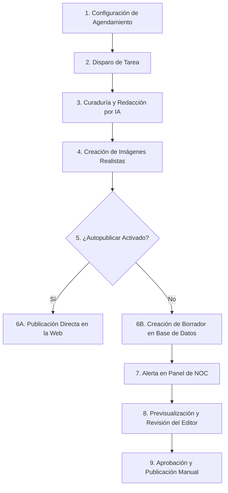

# Módulo de Auto Generación de Noticias - Guía de Usuario

Este documento explica de forma sencilla y no técnica cómo funciona el módulo de **Auto Generar Noticias** en el portal NOC, las acciones que puedes realizar como usuario y el flujo que sigue el sistema para crear y publicar artículos periodísticos asistidos por Inteligencia Artificial.

---

## 🎯 ¿Qué hace este módulo?

El módulo de Auto Generación de Noticias permite programar y automatizar la búsqueda, redacción e ilustración de artículos de prensa a partir de fuentes de información y temas específicos que tú definas. 

El sistema redacta los artículos en un lenguaje periodístico profesional, genera imágenes fotorrealistas para ilustrar la portada y el cuerpo de la noticia, y te permite previsualizar y aprobar cada artículo antes de que se publique de cara al público general.

---

## 🛠️ Acciones que puedes realizar en la plataforma

Como editor o administrador del portal, tienes el control total sobre el flujo de generación a través de las siguientes acciones:

### 1. Crear un Nuevo Agendamiento Automático
Puedes programar al sistema para que busque y genere noticias de forma periódica haciendo clic en **"Nuevo Agendamiento"**. Al crear uno, configuras:
* **Nombre / Tema**: El asunto o palabra clave sobre la cual la IA buscará información (ej: "Lanzamientos tecnológicos", "Eventos económicos").
* **Fuentes de Información**: Las direcciones web (URLs) autorizadas de las cuales la IA extraerá la información de forma estricta.
* **Programación (Frecuencia)**: El intervalo de tiempo en el que se ejecutará la tarea (ej: cada hora, cada 6 horas, o a una hora fija específica al día).
* **Publicar Automáticamente (Checkbox)**:
  * **Si está activado (Autopublicar)**: Tan pronto como la IA termine de redactar la noticia, se publicará de inmediato en el portal web sin intervención humana.
  * **Si está desactivado (Revisión manual)**: La noticia se guardará como un **Borrador Pendiente** para que un humano la revise primero.

### 2. Ejecutar de Forma Inmediata ("Ejecutar ahora")
Si no quieres esperar a que llegue la hora programada para un agendamiento, puedes pulsar el botón **"Ejecutar ahora"** (ícono de rayo ⚡). Esto forzará al sistema a buscar noticias sobre ese tema en ese mismo instante.

### 3. Ver Borradores Pendientes
Junto a cada agendamiento verás un botón verde con el ícono de un periódico y un **indicador rojo (badge)** con el número de noticias generadas que están esperando tu revisión. Al hacer clic, se abrirá la bandeja de borradores pendientes correspondientes a ese tema.

### 4. Previsualizar la Noticia
En la bandeja de borradores, al hacer clic en **"Previsualizar"**, el sistema abrirá una ventana que te mostrará la noticia redactada y maquetada exactamente tal como se verá en el sitio web oficial, incluyendo títulos, espaciados de párrafo, textos en negrita y las imágenes fotorrealistas generadas para el artículo.

### 5. Publicar el Borrador
Una vez que hayas revisado el borrador y estés conforme con la redacción y las imágenes, haz clic en **"Publicar"** (ícono de planeta 🌐) para que la noticia se suba de inmediato al portal oficial y sea visible para todo el público.

### 6. Editar o Eliminar Agendamientos
Puedes modificar los temas, las fuentes y los horarios de cualquier agendamiento existente mediante el botón **"Editar"** (lápiz ✏️), o eliminarlo de forma definitiva con el botón **"Eliminar"** (bote de basura 🗑️).

---

## 🔄 Flujo Funcional del Sistema (Paso a Paso)

A nivel de negocio y de cara al usuario, el proceso de generación sigue este ciclo de vida:

### Paso 1: Disparo de la Tarea (Automático o Manual)
Llegada la hora programada (o cuando pulsas "Ejecutar ahora"), el sistema inicia el proceso de búsqueda sobre el tema asignado.

### Paso 2: Lectura de Fuentes and Redacción de la Noticia
La Inteligencia Artificial accede estrictamente a las fuentes que definiste y lee la noticia. Utilizando sus propias palabras (para evitar el plagio y derechos de autor) redacta un artículo largo y fluido en español con estructura de prensa (títulos, subtítulos y cuerpo de desarrollo).

### Paso 3: Diseño de Ilustraciones Periodísticas
El sistema analiza el contexto de la noticia redactada y crea instrucciones detalladas para generar imágenes de tipo fotorrealismo periodístico (simulando fotografías reales tomadas en el lugar de los hechos). Genera una imagen principal de portada y de 1 a 3 imágenes de apoyo que se insertan a lo largo del texto.

### Paso 4: Determinación de Destino (Autopublicar vs. Revisión)
* Si el agendamiento tenía activada la opción **Autopublicar**, el artículo se envía de inmediato al portal web y queda visible para tus lectores.
* Si requiere **Revisión manual**, el sistema crea un **Borrador** con un identificador único y te alerta mediante el indicador numérico sobre el botón de acción en tu listado de agendamientos.

### Paso 5: Revisión Editorial y Publicación
El editor humano entra a la bandeja, previsualiza de forma segura el artículo y las imágenes correspondientes, y pulsa el botón de aprobación para publicarlo finalmente en la web.
